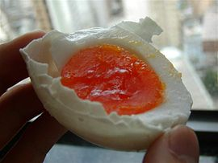

This is my first post on my new fake blog! How exciting!

I'm sure I'll write a lot more interesting things in the future.

Oh, and here's a great quote from this Wikipedia on [salted duck eggs](http://en.wikipedia.org/wiki/Salted_duck_egg).

>A salted duck egg is a Chinese preserved food product made by soaking duck eggs in brine, or packing each egg in damp, salted charcoal. In Asian supeor.

